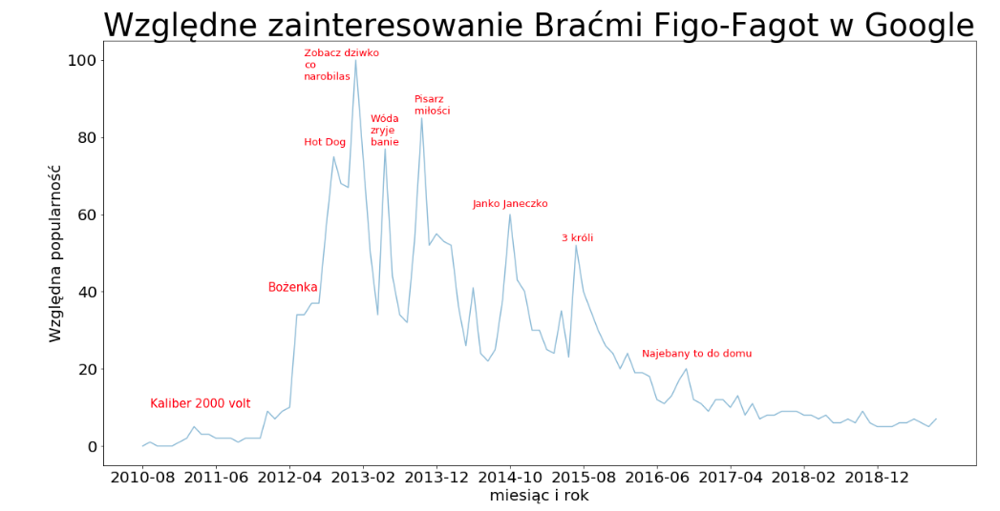
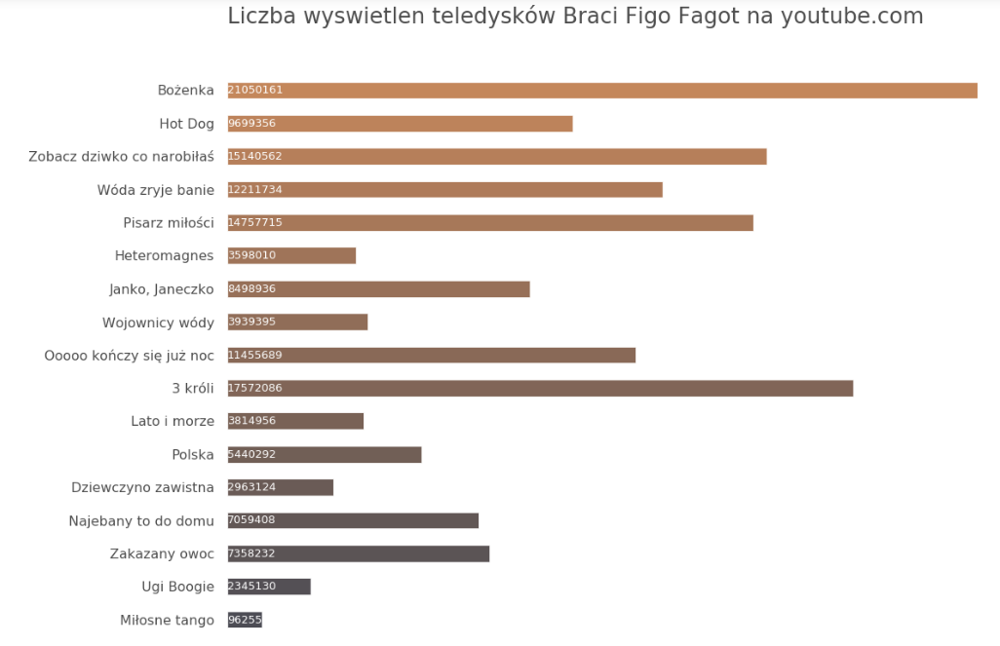

# visualizations

## PL 
Względne zainteresowanie/popularność w wyszukiwarce google cieszącej sie rozpoznawalnością grupy "Bracia Figo Fagot".
Dane zostały ściągnięte w formacie csv ze google.trends.com, po czym uległy przekształceniu za pomocą takich jak narzędzi jak Python(Pandas, Matplotlib). Czerwonym kolorem na wykresie zostały zaznaczone nazwy teledysków z odpowiadącą im datą premiery na serwisie youtube.com. Jak można zauważyć, skoki popularności następowały zazwyczaj po premierach teledysków.

Na tym wykresie zostały przedstawione bezwględne wartości wyświetleń teledysków na youtube. Teledyski zostały przedstawione w kolejności w jakiej pojawiały sie na serwisie. 

Zrodla danych:
https://pl.wikipedia.org/wiki/Bracia_Figo_Fagot

https://www.youtube.com/ 20.07.2019

https://trends.google.com/trends/explore?date=today%205-y&q=%2Fm%2F0sgqppw&hl=en-US
